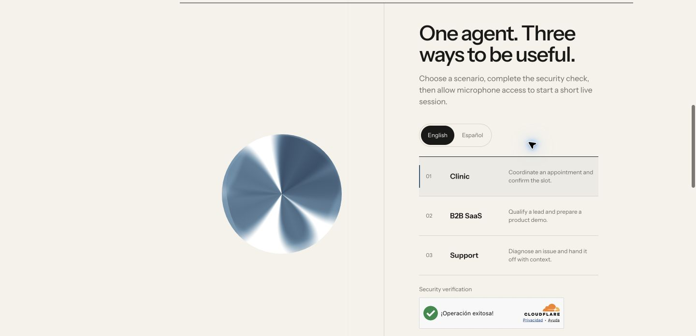

# LiveKit voice agent demo

[](https://github.com/PucciRomeroTobias/voice-agent-demo/actions/workflows/ci.yml)
[](LICENSE)

A bilingual, real-time voice agent built with LiveKit Agents and Python. This is the public agent runtime connected to [Tobias Pucci Romero's portfolio](https://tobiaspucci.dev/#demo).

**[Try the live demo](https://tobiaspucci.dev/#demo)**



The portfolio offers three short, self-contained scenarios: scheduling a clinic appointment, qualifying a B2B SaaS inquiry, and triaging a support request. Every business action is an in-memory mock; the demo never creates appointments, leads, or support cases.

## How it works

```text
Portfolio UI → protected token endpoint → LiveKit room → this agent
                                                    ↓
                                               STT → LLM → TTS
                                                    ↓
                                      structured mock result → UI
```

The portfolio application owns the browser UI, abuse controls, room creation, and short-lived participant tokens. This repository owns the LiveKit agent worker, conversation policy, scenario tools, and structured result contract. The portfolio is deployed separately on Cloudflare Workers; this repository does not publish the website or issue browser tokens.

Each session:

- starts in English or Spanish from validated dispatch metadata;
- follows the language used in the visitor's latest turn;
- keeps one immutable scenario configuration for the whole call;
- publishes a safe mock result on the `voice-demo-result` data topic;
- ends after completion, inactivity, a user request, or a two-minute hard limit.

The public configuration intentionally prioritizes low operating cost and predictable limits. It therefore does not necessarily use the most advanced available combination of models, infrastructure, capabilities, or output quality. Those choices are appropriate for an open portfolio demo, not a claim about the best production architecture for every use case.

## Repository layout

```text
src/agent.py                 LiveKit worker entrypoint and session lifecycle
src/voice_demo/config.py     validated session configuration and prompts
src/voice_demo/scenarios.py  scenario definitions and in-memory tools
tests/                       deterministic unit tests
docs/architecture.md         detailed runtime design
```

## Run locally

Requirements:

- Python 3.10–3.14
- [uv](https://docs.astral.sh/uv/)
- a LiveKit Cloud project
- an OpenAI API key

Install the locked environment:

```bash
git clone https://github.com/PucciRomeroTobias/voice-agent-demo.git
cd voice-agent-demo
cp .env.example .env.local
uv sync --locked
```

Fill `.env.local` with credentials from your own accounts. The file is ignored by Git. Never copy values from another deployment or commit a generated `livekit.toml`.

Start an interactive terminal session:

```bash
uv run python src/agent.py console
```

Or expose the local worker to a LiveKit client:

```bash
uv run python src/agent.py dev
```

Console mode defaults to Spanish and the clinic scenario. You may set `VOICE_DEMO_LANGUAGE` to `en` or `VOICE_DEMO_SCENARIO` to `saas_b2b` or `support` before startup.

## Dispatch contract

The client selects a language and scenario through job metadata:

```json
{"language":"en","scenario":"support"}
```

Allowed languages are `en` and `es`. Allowed scenarios are `clinic`, `saas_b2b`, and `support`. Invalid values fall back to safe defaults. A client integrating this worker should enforce the same allowlist before creating a dispatch.

The agent name and explicit dispatch target are `voice-demo`. See [the architecture document](docs/architecture.md) for the complete session and result contracts.

## Test and audit

```bash
uv sync --locked
uv run ruff check src tests
uv run pytest
uv run pip-audit --skip-editable
```

CI runs the same checks on every pull request and every push to `main`. Tests do not require cloud credentials and do not make model calls.

## Deploy to LiveKit Cloud

Install and authenticate the [LiveKit CLI](https://docs.livekit.io/home/cli/cli-setup/), select your own project, then create the worker once:

```bash
lk cloud auth
lk project list
lk project set-default "<your-project>"
lk agent create --secrets-file /dev/null
```

LiveKit generates a local `livekit.toml` for that deployment. It can contain deployment-specific identifiers and is intentionally ignored. Keep credentials in the platform's secret store, not in the repository.

For later revisions:

```bash
lk agent deploy --secrets-file /dev/null
lk agent status
lk agent logs --log-type deploy
```

This repository validates deployable code but does not automatically deploy the public portfolio or the LiveKit worker. The live website is published by the separate portfolio project on Cloudflare Workers.

## Privacy and limitations

- The worker does not persist audio or transcripts.
- Model response storage is explicitly disabled by this runtime.
- Technical latency metrics may be emitted to deployment logs without conversation content.
- The browser-facing portfolio uses separate server-side credentials and abuse controls; no LiveKit secret belongs in this repository or a browser bundle.
- The scenarios demonstrate interaction patterns, not medical advice or real business operations.

Please report security issues privately through GitHub as described in [SECURITY.md](SECURITY.md).

## Contributing

Contributions are welcome. Read [CONTRIBUTING.md](CONTRIBUTING.md) and open a pull request. Changes to language handling, metadata, or session configuration should include tests.

## License

[MIT](LICENSE) © 2026 Tobias Pucci Romero.
